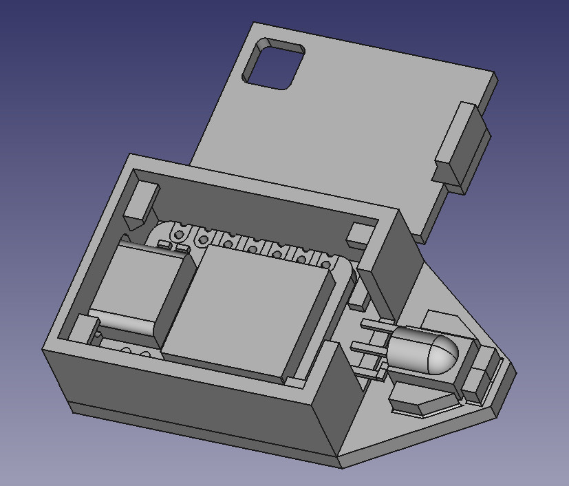
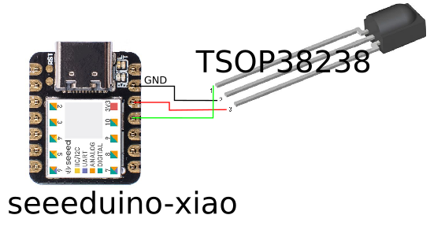
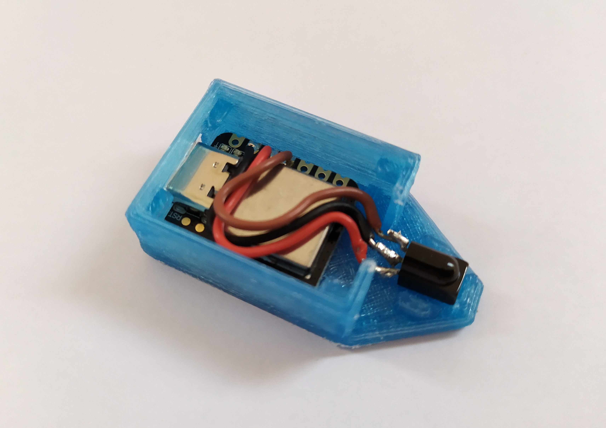
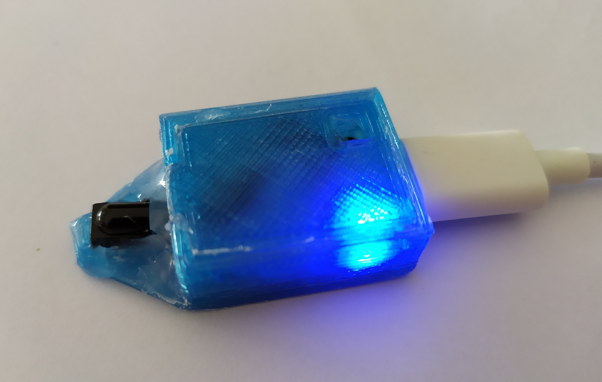

# xiao-ir-media - arduino IR media player controller

## Goal
This arduino sketch is used to control media player (kodi for my use case) from various ir remote control. Arduino acts as usb keyboard.



## License
MIT

## Project directories
 * **./**: arduino sketch.
 * **./external**: external libraries.
 * **./imgs**: schema and illustrations.
 * **./case**: FreeCAD object (xiao, tsop38238, case) and STL case to print.

## Hardware
This project use only a Seeeduino XIAO and a TSOP38238 infrared receiver.  

Note: this project can work on other SAMD21 arduino board as arduino zero. On other USB board, as arduino micro, storage functions have to be adapter to EEPROM.  

Many infrared remote control work thanks to the infrared remote library used in this project.

## Wiring
TSOP38238 has 3 three pins (OUT, GND, VSS) which must be connected to the xiao (D10, GND, 3V3).

__Schema:__



## External libraries
To compile for Seeeduino XIAO, Seeed SAMD boards has to be installed from the board manager.  

Note: I had a problem with v1.7.2 board and USB HID. So, I use the v1.6.5.

Two libraries have to be installed:
 *  Ir receiver library with SAMD21 support: https://github.com/agn0stico/Arduino-IRremote-MKR1000
 *  USB HID with extended features: https://github.com/NicoHood/HID
 
The libraries are also stored in the external directory.  
I thank the developers of these libraries.

## Customization
Keyboard keys are defined statically in INIT_MAPPING variables.

Two types of mapping can be defined:
 * TYPE_KEY: one or multiple key is pressed simultaneously.
 * TYPE_SEQUENCE: characters will be sequentially typed.

__Example:__

```c++
const KeyMapping INIT_MAPPING[] = {
{"UP",              TYPE_KEY,       KEY_UP},
...
{"Open script",     TYPE_KEY,       {KEY_LEFT_CTRL, KEY_LEFT_SHIFT, KEY_F12}},
...
{"Login",           TYPE_SEQUENCE,  "abcdef"}
```

## Configuration

The first time the program starts or after burning the sketch, the infrared remote buttons must be mapped to keyboard keys. It is also possible to enter configuration in normal operation, typing "configure" then enter key into the serial monitor.

For the configuration, open the serial monitor and click on IR remote button wanted for each mapping defined in INIT_MAPPING. A mapping can be avoided typing 'c' then ENTER in the serial monitor. If there is an error we can return the previous mapping with 'p'.
At the end, mapping is saved in the SAMD21 flash.

## Case

An STL file is present in the case directory allowing to print a box for this electronic mounting.



With the top cover and hotglue to protect electronics, not very clean :(



